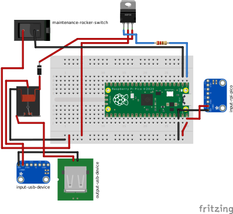

# Rasperry Pi Pico GPIO Relay Module

This is a small repo for a board to control a 5V relay with a Raspberry Pi Pico to connect random USB devices which turns on/off in intervals. There is also a maintenance rocker-switch to stop the interval when needed.

I'm currently using it to control the USB waterpump of my [hydroponic system](https://www.printables.com/model/554540-hydroponic-planting-tower-parametric).

## Fritzing

[Source `fritzing/rpi-pico-relay.fzz` file](fritzing/rpi-pico-relay.fzz "download")

### Breadboard

### Schem

